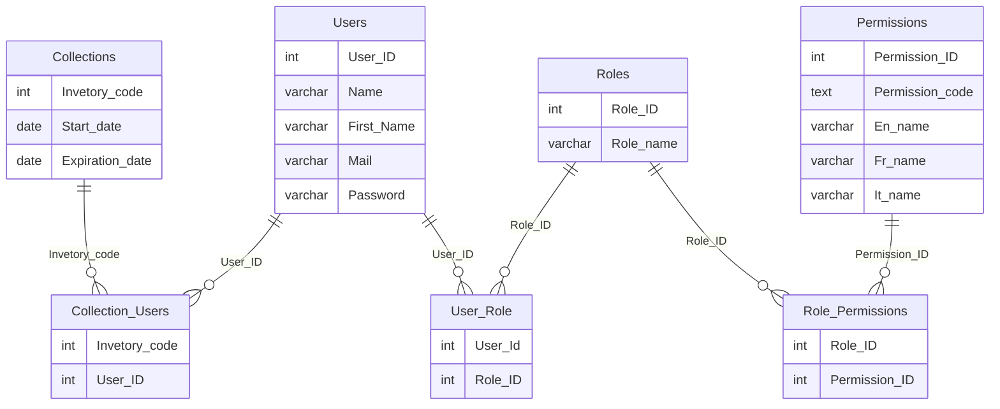

## Specie

```mermaid
erDiagram
    SPECIE ||--o{ CLASS : belongs_to
    SPECIE ||--o{ ORDER : belongs_to
    SPECIE ||--o{ FAMILY : belongs_to
    SPECIE ||--o{ GENUS : belongs_to
    SPECIE ||--o{ KINGDOM : belongs_to
    SPECIE ||--o{ STATUS : belongs_to
    SPECIE ||--o{ TYPE : belongs_to
    AIRPORT||--o{ SPECIEAIRPORT : belongs_to
    SPECIE ||--o{ SPECIEAIRPORT : belongs_to
    SPECIE {
        int Specie_ID
        string Scientific_name
        string French_vernacular_name
        string English_vernacular_name
        string Italian_vernacular_name
        string Romania_vernacular_name
        int Class
        int Order
        int Family
        int Genus
        int Kingdom
        int Status
        int Type
    }
    CLASS {
        int Class_ID
        string Class_name
        string Vernacular_class_name
    }
    ORDER {
        int Order_ID
        string Order_name
        string Vernacular_order_name
    }
    FAMILY {
        int Family_ID
        string Family_name
        string Vernacular_family_name
    }
    GENUS {
        int Genus_ID
        string Genus_name
        string Vernacular_genus_name
    }
    KINGDOM {
        int Kingdom_ID
        string Kingdom_name
        string Vernacular_kingdom_name
    }
    STATUS {
        int Status_ID
        string Status_name
    }
    TYPE {
        int Type_ID
        string Type_name
    }
    AIRPORT {
        int Airport_ID
        string Airport_fullname
        string Airport_shortname
    }
    SPECIEAIRPORT {
        int Airport_ID
        string Specie_ID
    }
```

## Collections


